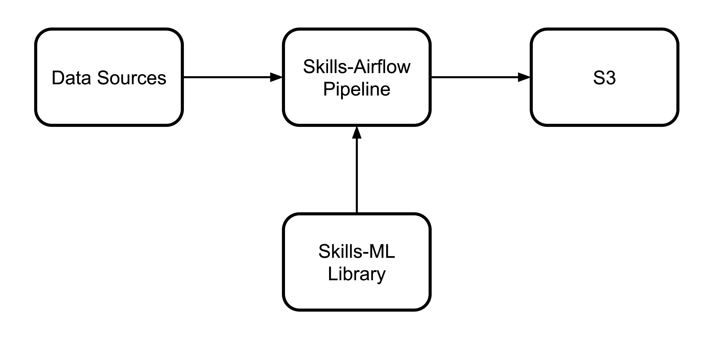

## Workforce Data Initiative

Open Skills Research Hub

Eddie Lin and Tristan Crockett

July 25, 2018

---

# What is WDI?

@fa[arrow-down]

+++

#### What is WDI?

The Workforce Data Initiative is a partnership launched by the Obama White House in 2015 as a partnership between public and private sector workforce data to facilitate standards, structure, and open access point for data underlying training, skills, jobs, and wages.

+++

#### What is WDI?

Work in WDI has been divided into two groups:

- *Open Skills Project* - Create a dynamic, open, common, locally relevant language for skills using public and private data. **<- our focus today**
- *Workforce Training Provider Scorecards* - Improve available information on education and training outcomes.

+++

#### ONET

The Open Skills Project aims to use data to improve on ONET, a competency and occupation framework produced by the Department of Labor using survey data. ONET is a good start but does not have any geographic granularity and is slow to update.

+++

#### Open Skills Project

Early work in the Open Skills Project focused on the Open Skills API, which presents data on skills and occupations as an open API. This was launched using only ONET survey data in 2016.

Originally the contents were to be replaced with data from job ads but the team wanted to gain confidence in results before packaging conclusions in an API. Development priorities were shifted to what would become the Research Hub.

---

# What is the Research Hub?

@fa[arrow-down]

+++

#### What is the Research Hub?

The Open Skills Research Hub is a *collection of publicly available generated datasets* produced by the Open Skills Project from a pool of *public and private administrative data sources*, particularly job postings, for the purpose of *collaborative research*.

+++

#### What is the Research Hub's Audience?

The Research Hub is aimed primarily at the research community (e.g. labor economists, NLP researchers). The goal is for these external researchers to be able to publish whitepapers based on the data. At present, there are two public whitepapers that use Research Hub data.

+++

#### How can the Research Hub help the Audience?

- Economists would like to answer a variety of questions about the labor market and how it changes over time and geography. Job ads can information about competencies, occupations, and wages that can be viewed across these axes. We are able to

- NLP researchers interested in the workforce would like to build on the work we've done in skills-ml

---

# What is in the Research Hub?

@fa[arrow-down]

+++

#### What is in the Research Hub?

- Tabular datasets grouping various attributes of job postings by time and geography
- Tabular datasets detailing different skill extraction methods, paired with evaluation metrics
- JSON-LD datasets each representing an ontology of competencies and occupations, usable by the skills-ml library
- Sequence-tagged labels of competencies for use in skill extraction algorithms
- Representativeness analysis compares Research Hub data with data from Bureau of Labor Statistics

+++

#### Tabular datasets grouping job postings over time and geography

Goal: common entry points for economists, making single files as useful as possible. When possible, choose a 'safe' version of an algorithm like skill extraction to represent here.

- Grouping columns: CBSA, year, raw/cleaned job titles or given ONET SOC codes
- Aggregate columns: Counts of job postings, top extracted skills, top inferred SOC codes, wage data

+++

#### Tabular datasets detailing skill extraction methods

Goal: a window into skill data by either more adventurous economists or NLP researchers looking for more details on the tradeoffs inherent in different skill extraction approaches. For each approach, package basic counts (year/soc code) alongside basic evaluation metrics

+++

- Skill extractors: matching based on known competency framework strings, heuristic NLP approaches (e.g. noun phrases that end in 'skill/s'), trained models based on human-labelled data
- Example Metrics: Recall of known competency frameworks (overall and per-occupation), total competency count, competencies per posting, competencies per occupation

+++

#### JSON-LD competency ontologies

Goal: Release known competency frameworks in the same format to inferred ontologies. Using the CTDL-ASN format, we can point the skills-ml Ontology class at URLs here to provide pre-mapped ontologies for use without bundling large datasets in the library code

- Mapping of ONET competencies/occupations
- Can map results of skill extraction to ontologies, but the results are public so we don't need to be the people to do this

+++

#### Sequence-tagged labels

Goal: Release human-tagged labels so NLP researchers can improve on skill extraction approaches without needing to access private data.

Human-tagging is done on a small sample of job postings that we can release so someone externally can build on this work to build a model using their own feature engineering.

+++

#### Representativeness analysis

Goal: Release couple representative analysis by generating comparable statistics by occupation, geography, and time from both Research Hub data and relevent national labor market datasets released by the Bureau of Labor Statistics.

- Job number distribution by state
- National occupation major group distribution
- Occupation major group distribution for CBSAs
- Occupation Distribution Correlation by state
- Percent change in Research Hub data v.s. JOLTS job openings data

---

# Representativeness Analysis

@fa[arrow-down]

+++

#### Job number distribution by state

---

# Architecture

@fa[arrow-down]

+++

#### Architecture

+++

#### How is data input into the system?

Job postings from various sources (on the order of tens of millions) are converted into the schema.org JobPosting format and serialized as one JSON object on each line. An id is assigned of a partner prefix followed by the id that the partner gave to the job posting. This data is stored in partitions of year+last four digits of id, on S3.

+++

#### How are the datasets computed?

The current iteration has a map-reduce structure, with each property (e.g. a specific skill extractor or occupational classifier) being computed in the 'map' step, and saving its per-posting output to S3 (in partitioned files). Each dataset is the result of a 'reduce' task that reads from the results from various 'map' tasks.

+++

*left*: map tasks, *right*: reduce tasks

+++

#### Parellelization

These steps are parallelized using Airflow's CeleryExecutor. A 'map' task is created per year/property, and a 'reduce' task each year/dataset. Originally we wanted to parallelize over day, but a partner data error forced us to zoom out to year. This is less than ideal but ~20 properties x 8 years still provides a lot of different parallel tasks.

+++

#### Partitioning

We want a deterministic partition key, to be able to rerun a map task and use data for job postings that have already been processed. Our first choice was date, but aforementioned partner data error forced a new pick: year + last 4 digits of job posting id.

+++

#### Data Dictionaries

Each computed property enforces metadata that allows column names and data dictionaries to be built automatically.

+++

#### Output

Datasets and data dictionaries are output to a public s3 bucket, and served from our static site using a JS library that allows browsing of public buckets.

+++

#### Code

- [skills-ml repo](https://github.com/workforce-data-initiative/skills-ml): Core, tested python library that is pip-installable
- [skills-airflow repo](https://github.com/workforce-data-initiative/skills-airflow): Orchestration of tasks 

---

# Lessons Learned

@fa[arrow-down]

+++

#### Lessons Learned: Code

Was the two-repo design good?

Pros: Separation of concerns, forced us to keep core routines testable and usable outside of the orchestration context
Cons: The users of the core routines (the orchestration DAGs) are disconnected so testing it is tough.

Alternate plan: Merge the airflow work into the same repository but don't include it in the Python module.

+++

#### Lessons Learned: Testing

Airflow code is hard to test because nothing is mockable; it shells out for everything. We never really addressed this head-on, and instead opted to move as much code as possible out of Airflow and into skills-ml.

Alternate plan: Since we already have an application-level config file that contains all input and output paths, utilize a test configuration file to create a full integration test without the need for any code-level mocks.

+++

#### Lessons Learned: Aggregation

Prior iterations of aggregation architecture did not serialize output of 'map' steps to S3. Drawbacks of this included:

- If an aggregation died 99% into it, you still had to do everything again
- Different aggregations could not reuse the same computed properties
- It was hard to trace confusing data in aggregations back to a job posting

Current iteration improves on all of these fronts.

+++

#### Lessons Learned: Partitioning

Prior iterations of the input ETL partitioned data using a deterministic size (load 10k postings into a file with a randomly-generated name), rather than deterministic location. Deterministic location is more helpful, in the absence of loading the data into a traditional database that supports ID lookups.

+++

#### Lessons Learned: Partitioning

Choice of partitioning key is subpar. Last four digits of id == 10000 partitions per year, which is overkill. Lots of time wasted in I/O.

Alternate plan: Last three digits (or even two?) would be closer to the original goal of daily partitions

+++

#### Lessons Learned: Parallelism

- Open question: Relying on Airflow for parallelism has some simplicity gains over something like Spark.
